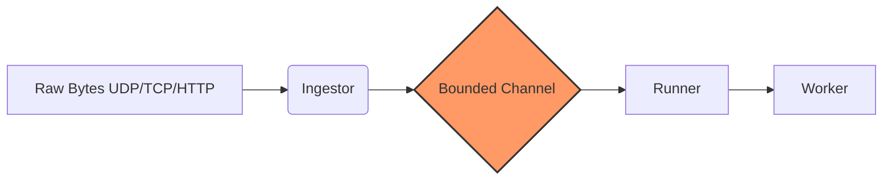

<p align="center">
  <a href="https://github.com/ingestix/ingestix">
    
  </a>
</p>

<p align="center">
  <strong>Focus on your data logic, not on SIGTERM handling or TCP framing.</strong>
</p>

<div align="center">

[](https://github.com/ingestix/ingestix/actions/workflows/ci.yml)

[](https://crates.io/crates/ingestix)

[](https://github.com/ingestix/ingestix/blob/main/LICENSE-MIT)


</div>

> ⚠️ **Pre-release Notice:** Ingestix is currently in very early development (**v0.1.1-alpha.1**). While functional, it is under active evolution. Please expect breaking changes as the API is refined. Use in production at your own discretion, and early adopters are warmly welcome to join the effort in shaping the future of Ingestix! 🚀

# Ingestix

Ingestix is an experimental high-performance, observability-first micro-framework for Rust that bridges raw network ingestion and structured data processing. Whether you are building a log aggregator, a real-time gateway for distributed databases, or a high-throughput webhook handler, Ingestix provides the core runtime you need.

---

## 🛠 Why Ingestix?

Writing a basic TCP or HTTP listener in Rust is straightforward. However, bridging the gap between a **raw socket** and a **reliable production service** involves a recurring set of complex challenges.

Ingestix addresses the "plumbing" of data ingestion so development can focus on business logic:

- **Lifecycle Management:** Out-of-the-box handling of `SIGTERM/SIGINT` for graceful shutdowns—ensuring no data is lost mid-flight.
- **Backpressure & Reliability:** Built-in concurrency limits and bounded buffering to prevent cascading failures when downstream systems slow down.
- **Operational Visibility:** Native Prometheus metrics provide immediate insight into ingestion rates, error ratios, and queue depths.
- **Hot-Swappable Config:** Built-in support for lock-free, atomic configuration updates via `arc-swap`, allowing system tuning without restarts.

Instead of reinventing the integration layer for every microservice, Ingestix provides a battle-tested asynchronous runtime designed for high-throughput data paths.

---

## ✨ Features

- **Zero-Boilerplate Logic:** Use `#[derive(FlowWorker)]` to focus purely on your business logic. The framework handles traits and async orchestration automatically.
- **Compile-Time Safety:** Procedural macros validate message types and worker configuration at compile time.
- **Protocol Agnostic:** Includes ready-to-use ingestors for **UDP**, **TCP (length-delimited)**, and **HTTP (webhooks via Axum)**.
- **Database & State Friendly:** Well suited as a high-speed gateway or sidecar for systems such as SurrealDB, MongoDB, or ClickHouse.
- **Built-in Observability:** Enable the `metrics` feature to expose Prometheus `/metrics` and `/health` endpoints.
- **Resilient Design:**
  - **Backpressure:** Bounded channels and semaphore-based concurrency limits prevent saturation.
  - **Graceful Shutdown:** Handles `SIGINT` and `SIGTERM`, allowing in-flight messages to finish before exit.
- **Type-Safe & Performant:** Built on `tokio`, `serde`, and `arc-swap` for throughput with low overhead.

---

## 📦 Architecture

Ingestix decouples the **Ingestion Layer** from the **Processing Layer** using an asynchronous pipeline:

**Data flow:** `Network (UDP/TCP/HTTP)` -> `Ingestor` -> `Bounded Channel` -> `Runner` -> `Worker`



1. **Ingestor:** Listens on the wire, deserializes payloads, and pushes data into a bounded internal channel.
2. **Runner:** Manages lifecycle, monitoring, and message distribution with concurrency controls.
3. **Worker:** Executes custom logic (for example persisting to database, transforming payloads, or triggering downstream actions).

---

## 🚀 Quick Start: HTTP Webhook

Add `ingestix` to your `Cargo.toml`. The `full` feature enables everything needed to get started.

```toml
[dependencies]
ingestix = { version = "0.1.1-alpha.1", features = ["full"] }
serde = { version = "1.0", features = ["derive"] }
tokio = { version = "1.0", features = ["full"] }
```

### Feature Matrix

| Use case | Recommended features |
| --- | --- |
| Standard setup | `["full"]` (derive + ingestors + metrics + logs) |
| Minimalist | `["derive", "ingestors", "logging"]` (no monitoring) |
| Custom ingestors | `["derive", "metrics"]` |

### Define Your Worker

```rust
use ingestix::{FlowWorker, HttpIngestor, Ingestix, SharedContext};
use std::sync::Arc;

#[derive(serde::Deserialize, Debug)]
struct MyData {
    event: String,
    value: f64,
}

#[derive(FlowWorker)]
// `config` is stored by Ingestix as `ArcSwap<Config>` (hot-swappable, lock-free reads).
// `state` is your app state type; use `Arc<ArcSwap<T>>` if you also want it swappable.
#[flow(message = "MyData", config = "()", state = "()")]
struct MyWorker;

impl MyWorker {
    async fn handle(&self, msg: MyData, _ctx: Arc<SharedContext<(), ()>>) -> anyhow::Result<()> {
        println!("Processing event: {} with value: {}", msg.event, msg.value);
        Ok(())
    }
}

#[tokio::main]
async fn main() -> anyhow::Result<()> {
    // Ingestix: concurrency=10 workers, channel buffer=100 messages.
    let runner = Ingestix::new((), (), 10, 100);
    runner.spawn_monitor_server(8080).await?;

    let ingestor = HttpIngestor::new("0.0.0.0:3000".parse()?, "/ingest");
    runner.launch(ingestor, MyWorker).await
}
```

`config` and `state` are intentional extension points:

- `config` is always wrapped by Ingestix as `ArcSwap<C>`, so workers/ingestors can read it cheaply with `ctx.config.load()`.
- `state` stays exactly the type you declare. Keep it as a plain shared object, or make it hot-swappable by declaring something like `Arc<ArcSwap<MyState>>`.

Example shape when you want both:

```rust
#[flow(message = "MyData", config = "AppConfig", state = "Arc<ArcSwap<AppState>>")]
struct MyWorker;
```

---

## ⚙️ Advanced Configuration

Each ingestor exposes a dedicated config struct for tuning performance and security:

```rust
use ingestix::{ApiKeyConfig, HttpConfig, HttpIngestor, HttpQueuePolicy};
use std::time::Duration;

let ingestor = HttpIngestor::with_config(
    "0.0.0.0:3000".parse()?,
    "/ingest",
    HttpConfig {
        api_key: Some(ApiKeyConfig::x_api_key("secret-token")),
        max_body_bytes: 2 * 1024 * 1024,
        request_timeout: Duration::from_secs(15),
        queue_policy: HttpQueuePolicy::Reject429,
        ..HttpConfig::default()
    },
);
```

---

## 📊 Monitoring & Health

Ingestix tracks message flow out of the box. Prometheus metrics are available at `http://localhost:8080/metrics`.

By default, the monitor server binds to `127.0.0.1` (loopback) to reduce accidental public exposure.

**Key metrics:**

- `flow_received_total`: Messages entering the network layer.
- `flow_ingested_total`: Messages successfully moved to the worker queue.
- `flow_rejected_invalid_json_total`: Messages rejected due to invalid JSON.
- `flow_rejected_invalid_api_key_total`: Messages rejected due to invalid or missing API key.
- `flow_rejected_overloaded_queue_total`: Messages rejected due to queue saturation/backpressure.
- `flow_queue_depth`: Current pressure on the internal buffer.

**Health checks:**

- `/health/live`: Basic liveness probe.
- `/health/ready`: Readiness probe (fails if worker error rates or queue depth exceed configured thresholds).

---

## ✅ Release Process

Before publishing a new version, run the project release checklist:

- [`RELEASE_CHECKLIST.md`](https://github.com/ingestix/ingestix/blob/main/RELEASE_CHECKLIST.md)

---

## 🤝 Contributing
Ingestix is an open-source initiative. Contributions in the form of bug reports, feature ideas, or pull requests are highly encouraged to help evolve the framework. Stay tuned for contribution guidelines as the project evolves.

---

## 🛡️ License

Licensed under either of:

- Apache License, Version 2.0 ([LICENSE-APACHE](https://github.com/ingestix/ingestix/blob/main/LICENSE-APACHE) or http://www.apache.org/licenses/LICENSE-2.0)
- MIT license ([LICENSE-MIT](https://github.com/ingestix/ingestix/blob/main/LICENSE-MIT) or http://opensource.org/licenses/MIT)

at your option.
